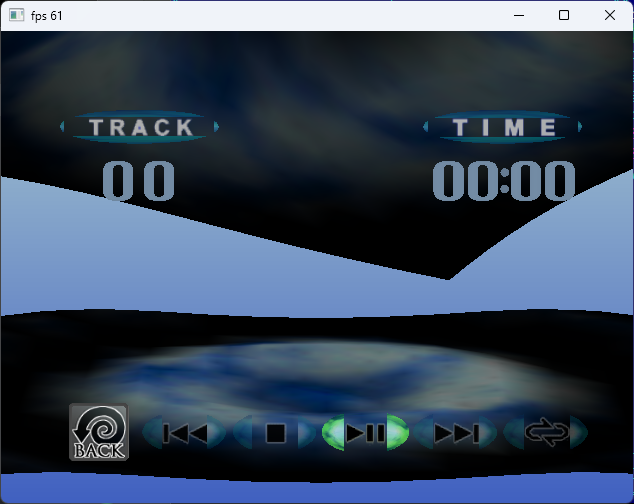

# Demul

| ||
|---|---|

Какие-то старые исходники. Удалось запустить BIOS.

Портировал для Visual Studio 2022 и на этом пока успокоился. Ждём от основных разрабов исходники посвежее.

## Сборка

Решение и все проекты находятся в папке VS2022. Открыть Demul.sln в студии, нажать на собрать.

X64 билд поддерживается только в режиме интерпретатора.

## Другие правки

- Кодовую базу перенёс в папку `src`
- Убрал систему плагинов. Нафиг надо. Plugins.c теперь называется Backends.c
